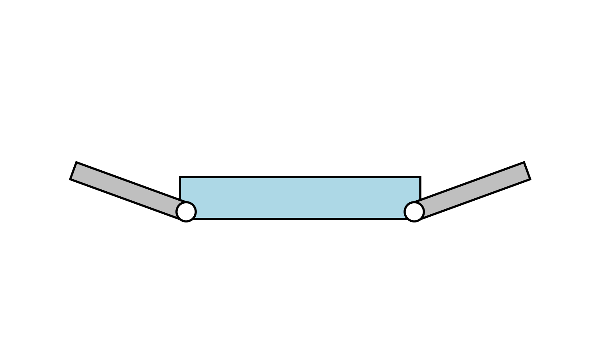

# crawlerimagegenerator
A script to draw a tracked crawler robot with front and rear sub-crawlers (flippers) using Matplotlib.

## Features
- Draws robot body, front flipper, and rear flipper with adjustable angles.
- Simple parameter editing (body, front, rear angles).

*Figure 1. Visualization of a tracked crawler robot generated using `crawlerrobot.py`.*
